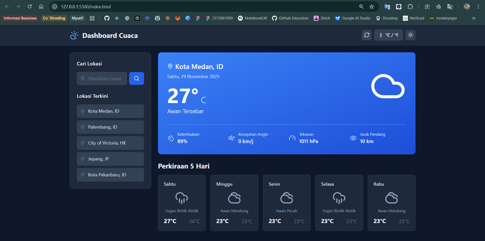
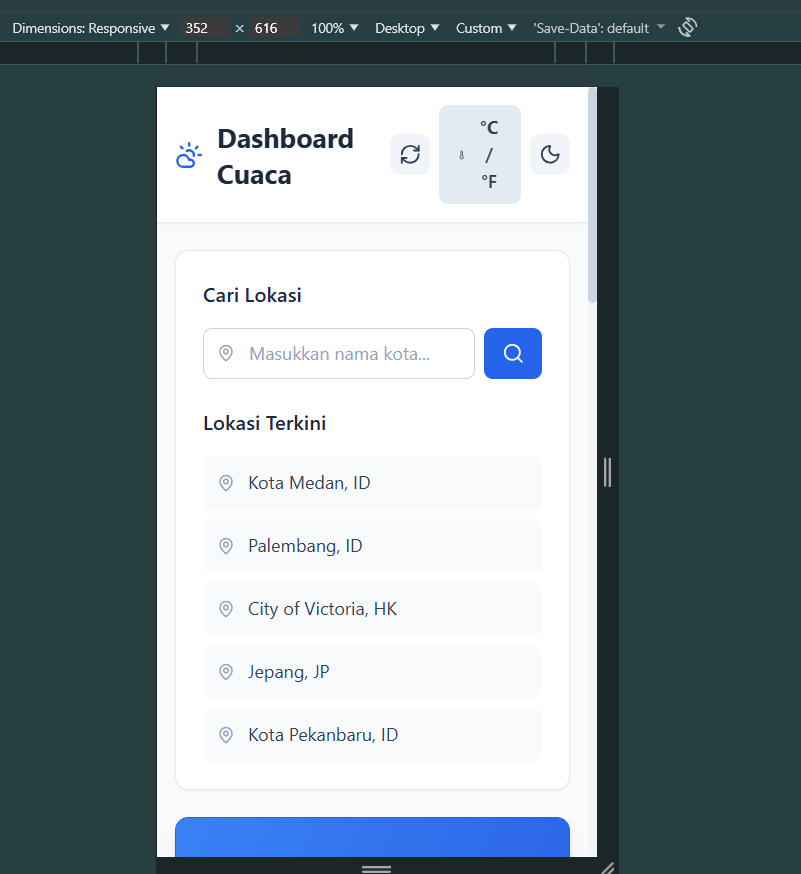
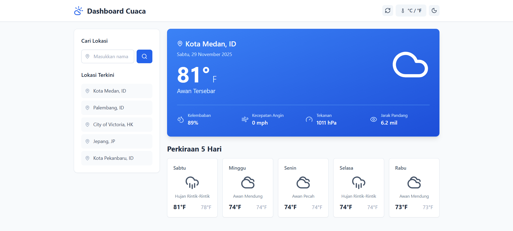

# Dashboard Cuaca

Dashboard cuaca modern dan responsif yang menampilkan informasi cuaca real-time menggunakan OpenWeatherMap API. Aplikasi ini dibangun dengan Vanilla JavaScript, Tailwind CSS, dan Lucide Icons.

## Screenshot

### Tampilan Utama


### Mode Gelap


### Pencarian Kota


## Fitur

- **Informasi Cuaca Real-time** - Suhu, kelembaban, kecepatan angin, tekanan, dan jarak pandang
- **Perkiraan 5 Hari** - Prakiraan cuaca untuk 5 hari kedepan
- **Pencarian Kota** - Cari cuaca di kota manapun dengan autocomplete
- **Mode Gelap** - Toggle antara mode terang dan gelap
- **Konversi Unit** - Beralih antara Celsius/Fahrenheit dan km/j/mph
- **Responsive Design** - Tampilan optimal di semua perangkat
- **Riwayat Pencarian** - Menyimpan lokasi yang pernah dicari
- **Lokalisasi Indonesia** - Antarmuka dan data cuaca dalam bahasa Indonesia

## Teknologi

- **HTML5** - Struktur aplikasi
- **CSS3** & **Tailwind CSS** - Styling modern dan responsif
- **Vanilla JavaScript (ES6 Modules)** - Logika aplikasi
- **OpenWeatherMap API** - Sumber data cuaca
- **Lucide Icons** - Ikon SVG yang elegan
- **LocalStorage API** - Penyimpanan preferensi pengguna

## Struktur Proyek

```
weather-dashboard/
├── index.html          # Halaman utama
├── css/
│   └── style.css      # Custom styling
├── js/
│   ├── app.js         # Entry point & controller
│   ├── api.js         # API service layer
│   ├── config.js      # Konfigurasi aplikasi
│   ├── dom.js         # Manipulasi DOM
│   ├── storage.js     # LocalStorage utilities
│   └── utils.js       # Helper functions
├── assets/
│   └── icons/
│       └── favicon.svg
└── screenshot/        # Screenshot aplikasi
```

## Instalasi & Penggunaan

1. **Clone repository**
   ```bash
   git clone https://github.com/firmanfarelrichardo/weather-dashboard.git
   cd weather-dashboard
   ```

2. **Konfigurasi API Key**
   
   Buka file `js/config.js` dan ganti API key dengan milik Anda:
   ```javascript
   export const API_KEY = 'YOUR_API_KEY_HERE';
   ```
   
   Dapatkan API key gratis di [OpenWeatherMap](https://openweathermap.org/api)

3. **Jalankan aplikasi**
   
   - Buka file `index.html` dengan Live Server di VS Code
   - Klik kanan pada `index.html` → pilih "Open with Live Server"
   - Aplikasi akan terbuka otomatis di browser default Anda

## Cara Menggunakan

1. **Cari Kota** - Ketik nama kota di kolom pencarian
2. **Pilih dari Saran** - Klik salah satu saran autocomplete
3. **Toggle Unit** - Klik tombol °C/°F untuk mengubah satuan suhu
4. **Mode Gelap** - Klik ikon bulan/matahari untuk mengubah tema
5. **Refresh** - Klik tombol refresh untuk memperbarui data
6. **Riwayat** - Klik lokasi di sidebar untuk melihat cuaca sebelumnya

## Fitur Unggulan

### Arsitektur Modular
- Kode terorganisir dengan ES6 modules
- Separation of concerns (API, DOM, Storage, Utils)
- Clean dan maintainable code

### User Experience
- Loading states dengan skeleton UI
- Error handling yang informatif
- Autocomplete untuk pencarian
- Transisi smooth antar state

### Data Persistence
- Preferensi unit tersimpan
- Riwayat pencarian tersimpan
- Tema tersimpan otomatis

## API Endpoints

- **Current Weather**: `/data/2.5/weather`
- **5-Day Forecast**: `/data/2.5/forecast`
- **Geocoding**: `/geo/1.0/direct`

## Lisensi

Proyek ini dibuat untuk keperluan pembelajaran.

## Author

**Firman Farel Ricardo**

---

Jika Anda menyukai proyek ini, berikan star di repository!